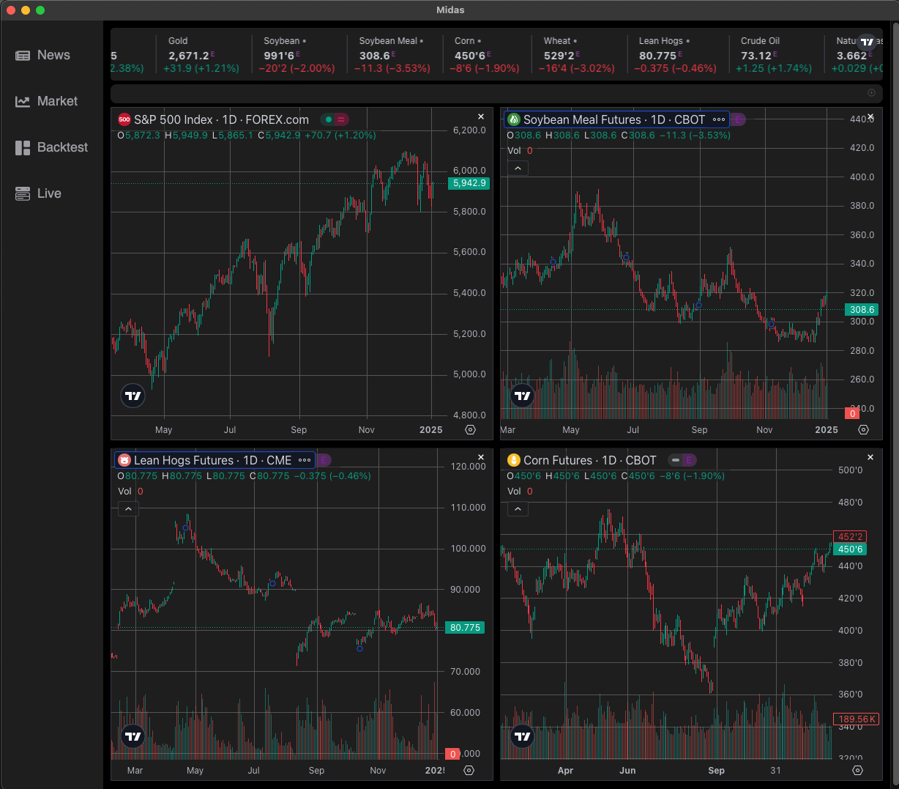
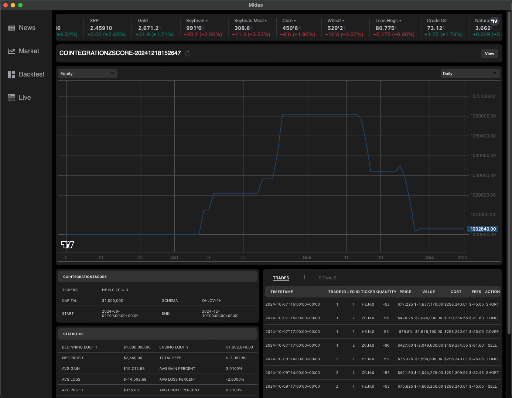

# Midas GUI

[](LICENSE)

## Overview

The Midas GUI is a React-based frontend desktop application for the Midas Trading System. It provides an intuitive and interactive interface for financial market analysis, accessing financial news, and visualizing backtest results.

The application currently features three key pages:

- **News Source**: Quick access to financial news from sources such as MarketWatch and CNBC, as well as links that open directly to sites including WSJ, Bloomberg and Barrons.
- **Market Charts**: Interactive market data visualizations powered by TradingView widgets for real-time insights across various asset classes.
- **Backtest Results**: Displays results from trading strategy backtests, dependent on the `midas-server` backend for data.

## Features

### **News Source**

- Provides an overview of the latest market-related headlines.
- Links to major financial news outlets such as MarketWatch, CNBC, and others for detailed stories.


### **Market Charts**

- Interactive TradingView widgets for assets like commodities, cryptocurrencies, indices, and futures.
- Real-time updates and chart customization options.



### **Backtest Results**

- Visualizes backtest performance data, including equity curves, trade summaries, and performance metrics.
- Requires the `midas-server` backend (currently closed source) to fetch and display results.



## Installation
```bash
curl -sSfL https://raw.githubusercontent.com/midassystems/midas-gui/main/scripts/install.sh | bash
```
## Configuration

After installation, the application creates a configuration file at `~/.config/midas/gui-config.toml`. Users will need to edit this file to customize their setup. Below is the default configuration:

```toml
[common]
log_level = "info"
midas_url = "http://127.0.0.1:8080"
api_key = "api_key"

[dashboard]
window_title = "Dashboard"
default_theme = "dark"
refresh_interval = 60
finnhub_key = "api_key"
finnhub_url = "https://finnhub.io/api/v1/news?category=general&token=yourapikey"
num_charts = 4
chart_symbols = ["FOREXCOM:SPXUSD", "CBOT:ZM1!", "CME:HE1!", "CBOT:ZC1!"]
```

### Key Configuration Options

1. **Finnhub API Key**: The news feed is powered by Finnhub. You will need to sign up for a free account on [Finnhub](https://finnhub.io/) and replace `yourapikey` in the `finnhub_url` with your API key.

2. **Midas URLs**: URL points to the `midas-server` backend. If the backend is run locally (e.g., via Docker), ensure URL matches local setup.

3. **Dashboard Settings**:
   - `window_title`: Customize the dashboard window title.
   - `default_theme`: Set the theme (`dark` or `light`).
   - `refresh_interval`: Frequency (in seconds) for refreshing data.
   - `num_charts`: Number of charts displayed on the dashboard.
   - `chart_symbols`: List of asset symbols displayed on the market charts.

## Backend Dependency

The GUI relies on the `midas-server` backend to fetch data for backtest results. The `midas-server` repository is now open source and can be deployed locally using Docker. For setup instructions, please refer to the [midas-server repository](https://github.com/midassystems/midas-server).

**Future Considerations**:
The backend may include an API key system to manage access for external users.
ers.

## Contributing

Contributions are welcome! Feel free to open an issue or submit a pull request with suggestions or improvements.

## Acknowledgments

This application leverages components from the [TradingView Charting Library](https://www.tradingview.com/) to provide market data visualizations, ensuring users have an interactive and seamless experience.

## License

This project is licensed under the Apache 2.0 License. See the [LICENSE](LICENSE) file for details.
